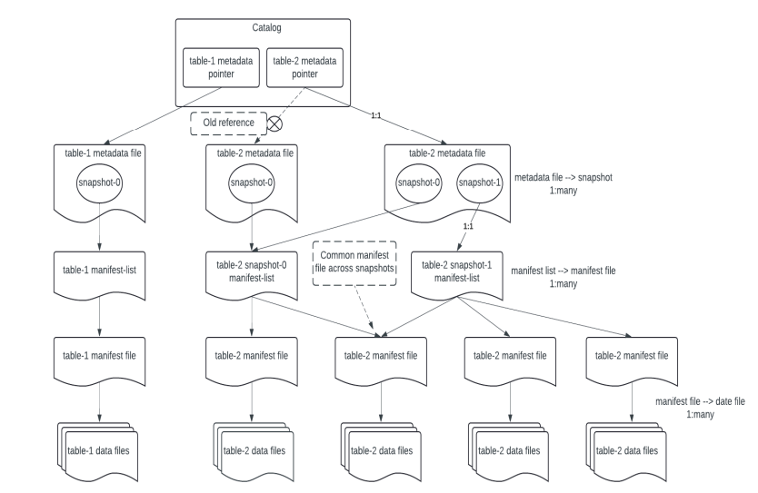

<h1 align="left">Um resumo sobre o Apache Iceberg</h1>

<h2>Data Lakehouse</h2>

O Iceberg é especialmente útil na arquitetura Data Lakehouse, assim, é fundamental entender esse conceito e, como o próprio nome diz, é uma junção de outras duas arquiteturas: o Data Lake e o Data Warehouse. Então, vamos ver um pouco sobre cada uma.

O Data Warehouse garante a qualidade dos dados e escalabilidade com seu sistema de armazenamento indexado e particionado, porém, por só permitir dados estruturados, acaba sendo muito custoso e pouco flexível.

Por outro lado, o Data Lake é um armazenamento que permite diferentes tipos de formatos de arquivos, trazendo consigo uma melhora no desempenho de consulta, além dos benefícios da interoperabilidade. Contudo, ele não consegue garantir a qualidade dos dados nem dá suporte a transações ACID.

Assim nasceu o Data Lakehouse, uma junção desses dois sistemas de armazenamento de dados. Ou seja, traz as propriedades ACID e a qualidade do Data Warehouse, ao mesmo tempo que tem baixos custos, aceita vários formatos de dados e possui a interoperabilidade do Data Lake. Além disso, essa arquitetura também suporta versionamento, possui um histórico que pode gerar relatórios e permite que diferentes processos podem utilizar os mesmos dados.

Aí surge uma pergunta: como isso é possível? Bom, isso é o resultado da junção de Open File Format e Open Table Format. Essa dupla combina um armazenamento eficiente e flexível (considerando que os Open File Format comprimem os dados e aceitam dados estruturados ou não) com funcionalidades de transação, versionamento e governança fornecidas pelo Open Table Format.

<h2>Open File Format</h2>

Com o crescimento do big data, iniciou-se uma busca por reduzir gastos com armazenamento e melhorar a eficiência dos acessos aos dados, assim nasceu os Open File Formats. Esse formato de arquivo possui dois tipos de orientação: por linha, tradicionais em DBMS; e por coluna, mais recentes e introducidos para lidar com altas performaces. Além disso, ele fornece menos gastos com infraestrutura, pois tem um modelo compressivo, o qual gera um armazenamento mais eficiente comparado a outros formatos de arquivos, também é interoperável, já que existem diversas tecnologias que aceitam e trabalham com Open File Formats, e mantém os dados integrados, reduzindo possíveis inconsistências neles.

<h2>Open Table Format</h2>

Um formato de tabela é um intermediário que define e organiza um conjunto de dados de uma forma mais fácil de vizualizar, entender e trabalhar com esses dados, ou seja, em um formato tabular.

Dessa maneira, um formato de tabela aberto (Open Table Format) se diferencia dos outros por ter uma camada de metadados, os quais são responsáveis por ter informações sobre os arquivos de dados abertos (Open File Format). Além disso, sempre que há uma requisição de alteração, o Open Table Format cria um novo arquivo com a mudança e deixa o arquivo original intacto. Então, um Open Table Format extrai a estrutura da tabela através dos metadados e cria um histórico de alterações nos dados ao criar novos arquivos e armazenar os antigos, assim, consegue promover transações ACID, CRUD, evolução dos schemas e melhora a performace de queries e novas escritas.

Alguns exemplos mais comuns de Open Format Table são: Iceberg, Delta Lake, Hudi.

  
<h2>Apache Iceberg</h2>

Finalmente, chegamos à resposta sobre o que é o Iceberg.

Ele nada mais é do que um formato de tabela, portanto, não oferece armazenamento, sendo do tipo Open Table Format. Assim, garantindo transações consistentes com propriedades ACID e, junto com o isolamento de snapshots (visualizações pontuais do estado atual de uma tabela), tem a possibilidade de diferentes serviços alterarem os dados de uma mesma partição simultaneamente, desde que não haja conflito.

O Iceberg, além de ser 100% código aberto, é integrado com o SQL, trazendo simplicidade nas operações do dia a dia, ademais, é bem flexível em questões de usabilidade rotineira, pois aceita várias tecnologias e bibliotecas (como, por exemplo: Spark, Trino, Impala, Snowflake, Presto, etc.). Essa variedade também ajuda em outra funcionalidade: a migração de tipo de tabela, a qual ocorre através de cópias dos arquivos de metadados originais ou reutilizando-os e apenas criando os novos arquivos no formato Iceberg.

Além disso, esse formato de tabela conta com mais algumas características:

<ul>
  <li>Partição "escondida"</li>
  
O usuário não precisa lidar com o particionamento dos dados, pois o próprio Iceberg já faz isso por trás dos panos.

  <li>Evolução do schema</li>
  
O Iceberg permite que as colunas sejam alteradas sem risco de prejudicar os dados, pois somente os arquivos de metadados são atualizados, desta forma, assegurando a consistência dos dados ao mesmo tempo que permite o crescimento do schema.

  <li>Histórico de ações</li>
  
Os snapshots permanecem guardados mesmo depois de terem sido substituídos por outros snapshots mais atuais, fazendo um versionamento de dados e disponibilizando consultas às formas antigas dos dados e da tabela.

  <li>Processamento incremental</li>
  
Somente os dados de uma última execução são processados, consequentemente, economizando processamento e memória.

  <li>Filtragem de partições</li>
  
O Iceberg otimiza as consultas através da omissão de dados desnecessários no contexto da consulta e da filtragem de partições, selecionando apenas o que é relevantes. Além disso, sua arquitetura de metadados otimizados contribui otimizando o desempenho das pesquisas.

</ul>

<h3>Arquitetura</h3>

Agora vamos entender um pouco sobre como o Iceberg consegue fazer isso?

Primeiramente, é importante saber que ele é dividido em três camadas:

<ul>
  <li>Catálogo</li>
  
O catálogo é responsável por rastrear a localização do arquivo de metadados mais recente, permitindo consultas consistentes e operações transacionais. Ele pode ser integrado a tecnologias externas como Hive Metastore, AWS Glue, ou JDBC-compatible catalogs.

  <li>Metadados</li>
  
Essa camada contém tudo sobre uma tabela em específico, como quais as colunas, seus tipo, quantidade, partições, versões, últimas alterações, etc. Também é dividida em outras três sub camadas.

  <ul>
    <li>Arquivo de metadados</li>
    
Contém um ou mais snapshots, assim, um catálogo armazena a localização para um arquivo de metadados (metadata file) e esse para um ou vários snapshots. Nesse arquivo json podemos encontrar detalhes sobre o schema da tabela, informação sobre partição, id do snapshot atual (current-snapshot-id), o caminho para a lista de manifesto (manifest list), etc.

    <li>Arquivo com listas de manifestos</li>
    
Cada snapshot têm um ou mais arquivos manifesto (manifest-file) e esse arquivo .avro contém as informações sobre a localização de um ou vários arquivos manifesto.

    <li>Arquivo manifesto</li>
    
Por fim, esse arquivo lista os arquivos de dados dentro de uma partição e contém metadados adicionais, como estatísticas de colunas e versões. Ajudando na otimização de leitura e filtragem de dados.

  </ul>
  <li>Dados</li>
  
A última camada é onde estão os dados em si, em um Open File Format

</ul>

<h4>Explicando a imagem</h4>

Saha, Dipankar, Disruptor in Data Engineering - Comprehensive Review of Apache Iceberg, Disponível em: <a href="https://ssrn.com/abstract=4987315" target="_blank">SSRN</a> ou <a href="http://dx.doi.org/10.2139/ssrn.4987315" target="_blank">DOI</a>

O catálogo tem duas tabelas, então falando sobre a table-1 primeiro: por não ter tido atualizações, existe somente um snapshot no seu arquivo de metadados, o qual está sendo referenciado no catálogo; Esse snapshot contém o estado atual da tabela e está associado a um único manifest-list que, por sua vez, aponta para um único manifest-file, esse último contém os dados de uma partição. Na segunda tabela, após uma atualização, o catálogo é modificado para referenciar um novo metadata criado com o snapshot antigo e o snapshot da table-2 atual; O snapshot antigo permanece referenciando o manifest list, conseguentemente o manifest file e os dados de antes enquanto que o novo snapshot referencia um novo manifest-list, o qual contempla três manifest-file, cada um com a localização para os dados de novas partições.

É desta forma que o Iceberg concegue criar as patições sem a participação do usuário e atualizar o schema da tabela sem mexer nos dados.

<h4>Um exemplo prático</h4>

Ao criar uma tabela, um <a href="table_exemplo/metadata/metadata-00001.json">metada file</a> é gerado com o primeiro <a href="table_exemplo/metadata/snapshots/00000000000000000001.json">snapshot (spt0)</a> do estado inicial da tabela, ou seja, com ela vazia. Logo em seguida, fazemos o primeiro insert na tabela, então é adicionado um novo <a href="table_exemplo/metadata/snapshots/00000000000000000002.json">snapshot (spt2)</a> no metadados e também é criado um <a href="table_exemplo/metadata/manifest-lists/manifest-list-00002.avro">manifest-list</a> com um <a href="table_exemplo/metadata/manifest-00002.avro">manifest file</a> referenciando os arquivos de dados inseridos. Por último, vamos fazer um merge com novos dados: cria-se um novo <a href="table_exemplo/metadata/metadata-00003.json">metada file</a> contendo os últimos dois snapshots mais o <a href="table_exemplo/metadata/snapshots/00000000000000000003.json">novo snapshot (spt3)</a>. O spt2 permanece guardando informações sobre o seu manifest-list de quando ele foi criado e o spt3 contém um novo <a href="table_exemplo/metadata/manifest-lists/manifest-list-00003.avro">manifest-list</a>.

